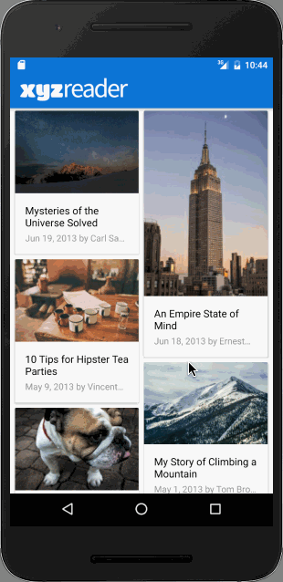

# XYZ-Reader---Udacity
Project 5 in Udacity Android Developer Nanodegree

# Walk through stories:

### Required Tasks
* Download a zip file of the app.
* Read the UI Review in the next node.
* Spend time exploring the current state of the app, looking for ways it could be improved. The app will need multiple improvements. Be sure to look specifically at issues called out in the UI Review.
* Execute the improvements!
* Make a single GitHub repo with your code for the app and submit it through the Nanodegree portal. See the Submission and Evaluation node for detailed instructions.
* For detailed information on how your project will be assessed, see the Rubric node.

## User Feedback for XYZ Reader:
* Lyla says:
“This app is starting to shape up but it feels a bit off in quite a few places. I can't put finger on it but it feels odd.”
* Jay says:
“Is the text supposed to be so wonky and unreadable? It is not accessible to those of us without perfect vision."
* Kagure says:
“The color scheme is really sad and I shouldn't feel sad.”
